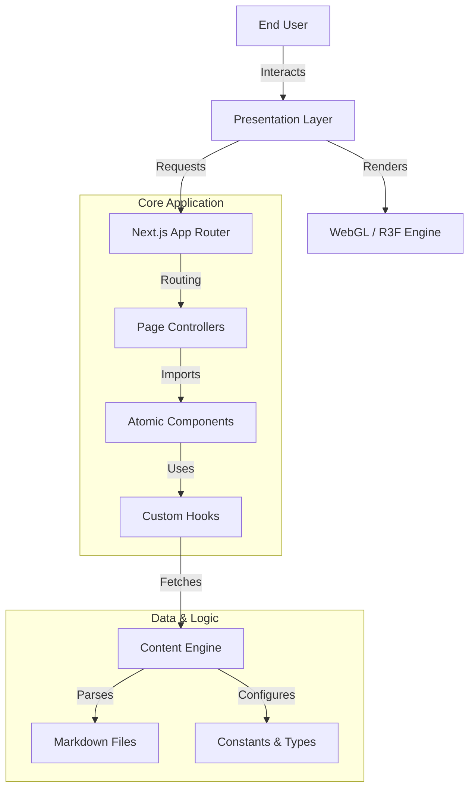

# 🏛️ PROJECT CODEX: THE JUNG ARCHIVE
> **"Wholeness is not achieved by cutting off a portion of one's being, but by integration of the contraries."** — C.G. Jung

   

## 📑 Executive Summary
**The Jung Archive** is a high-fidelity **Cinematic Web Experience** designed to digitize and visualize the complex psychological framework of Carl Gustav Jung. Unlike traditional archives, this project leverages bleeding-edge WebGL rendering and immersive UI paradigms to create a "Digital Mandala"—a spatial interface where users explore abstract concepts (Alchemy, Archetypes, The Unconscious) through interactive 3D artifacts and atmospheric storytelling.

---

## 👁️ The Vision: Digital Surrealism
The project aims to transcend the "Blog" or "Wiki" format, aiming instead for an **interactive grimoire**. Every pixel is designed to evoke the feeling of peering into the unconscious.

### Core Visual Pillars:
*   **The Void Aesthetic**: A deep-space palette (`#000508`) that serves as the canvas for the mind's projections.
*   **Alchemical Gold**: Highlights in `#ffd700` and `#d4af37` symbolizing the "Great Work" (Magnum Opus).
*   **Sacred Geometry**: Utilizing Mandalas and Platonic solids as navigation anchors.

---

## 🏗️ System Architecture

Engineered with a focus on **Semantic Architecture**, **Performance Optimization**, and **Scalable Content Management**.



### 📂 Directory Structure v3.0 (Clean Architecture)
```bash
jung_archive_app/
├── 📂 app/                     # Controller Layer
│   ├── (system)/               # Playground, Debug, Experiments
│   ├── select/                 # Core Navigation (Mandala Hub)
│   │   ├── library/            # 📚 Digital Library Module
│   │   └── pillar/             # 🏛️ Dynamic Pillar Module
│   └── page.tsx                # Cinematic Landing (The Threshold)
│
├── 📂 components/              # View Layer (Atomic Design)
│   ├── 🧊 3d/                  # WebGL Components (Heavy Duty)
│   │   ├── backgrounds/        # Shaders (Galaxy, Nebula, Starfields)
│   │   ├── objects/            # Interactive Models (Artifacts)
│   │   └── scenes/             # High-level compositions
│   │
│   ├── 🎨 ui/                  # 2D Interface Components
│   │   ├── effects/            # CRT Grain, Meteor Rain, Solar Flares
│   │   └── features/           # Journaling, Oracle UI, Nav Bars
│   │
│   ├── 📐 templates/           # Layout Blueprints
│   └── 🎬 transitions/         # Motion Orchestration (VFX Entrances)
│
├── 📂 content/                 # Data Layer (Headless MDX Pattern)
│   └── *.md                    # 131+ Archival Files
│
└── 📂 lib/                     # Domain Layer
    ├── content-config.ts       # Content Mapping Kernel
    └── utils.ts                # Pure Logic Helpers
```

---

## ⚡ Technical Specification

### 1. Engine & Framework
*   **Next.js 16 (Turbopack)**: Leveraging Server Components for instant metadata delivery and Client Components for heavy interactivity.
*   **React 19**: Utilizes concurrent rendering to keep the 3D frame-rate consistent even during DOM updates.

### 2. Immersive Visual Layer
*   **WebGL / R3F**: Scenegraph managed via React Three Fiber.
*   **Custom Shader Materials**: Hand-written GLSL for logic-defying materials like **"Liquid Gold"**, **"Psychic Ink"**, and **"Neural Mesh"**.
*   **Post-processing Pipeline**:
    *   **Bloom**: For ethereal glows.
    *   **Chromatic Aberration**: For a dream-like, slightly unstable visual quality.
    *   **Noise/Scanlines**: For the "Archival Record" feel.

### 3. Motion System
*   **Framer Motion 12**: Synchronizes 2D UI with 3D scene events.
*   **Thematic Entrances**: 10 unique, symbolically accurate entrance transitions for each pillar (e.g., "Liquid Gold Fusion" for Alchemy).

---

## 🚀 Experience Workflow
1.  **The Threshold (Landing)**: A portal into the work.
2.  **The Mandala (Select)**: An orbiting 3D interface for navigation.
3.  **The Pillar (Subject)**: Immersive 3D visualization of a specific Jungian concept.
4.  **The Codex (Reading)**: A focused "Deep Reader" environment optimized for long-form study.

---

## 🔧 Installation & Deployment

### Prerequisites
*   Node.js v18.17+ (LTS)
*   npm v9+
*   GPU with WebGL2 Support

### Local Development
```bash
# 1. Clone & Enter
git clone [repository-url]
cd jung_archive_app

# 2. Install (Strict Ecosystem)
npm install --legacy-peer-deps

# 3. Development Mode
npm run dev
# Access: http://localhost:8080
```

### Production Build
```bash
npm run build
npm start
```

---

## 📚 Content Protocol
To add to the archive, create a `.md` file in `/content` with the following schema:

```yaml
---
title: "The Collective Unconscious"
description: "A blueprint for the human psychic structure."
pillarId: "concepts"
order: 1
image: "/assets/thumb.jpg"
published: true
---
```

---

## 🗺️ Roadmap
- [x] Phase 1: Core 3D Mandala Engine
- [x] Phase 2: Digital Library Integration (131+ records)
- [x] Phase 3: Thematic Entrance Transitions
- [ ] Phase 4: AI "Oracle" Integration (Talk to the archive)
- [ ] Phase 5: VR/WebXR Support for immersive meditation

---

## 🛡️ Credits
- **Engineering**: Antigravity AI
- **Direction**: User (Philosophical Lead)
- **Engine**: Three.js & Framer Motion

> *“I am not what happened to me, I am what I choose to become.”*
