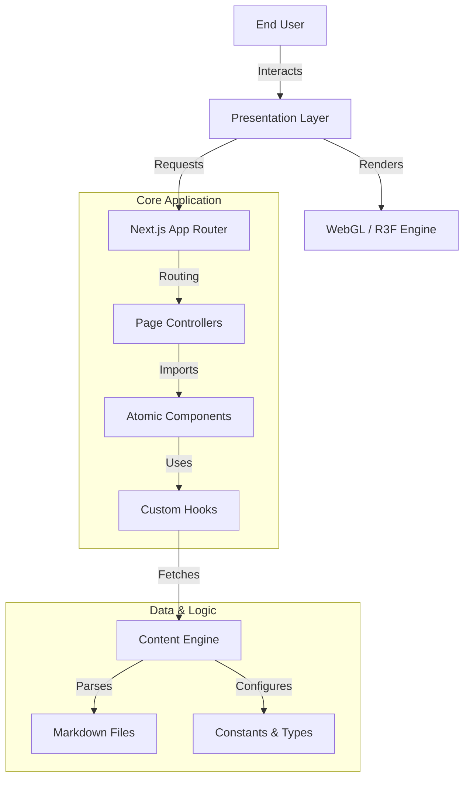

# 🏛️ PROJECT CODEX: THE JUNG ARCHIVE
> **"Wholeness is not achieved by cutting off a portion of one's being, but by integration of the contraries."** — C.G. Jung

  

## 📑 Executive Summary
**The Jung Archive** is a high-fidelity **Cinematic Web Experience** designed to digitize and visualize the complex psychological framework of Carl Gustav Jung. Unlike traditional archives, this project leverages bleeding-edge WebGL rendering and immersive UI paradigms to create a "Digital Mandala"—a spatial interface where users explore abstract concepts (Alchemy, Archetypes, The Unconscious) through interactive 3D artifacts and atmospheric storytelling.

This repository hosts the complete source code for the platform, engineered with a focus on **Semantic Architecture**, **Performance Optimization**, and **Scalable Content Management**.

---

## 🏗️ System Architecture

The project adopts a strict **Clean Architecture** pattern, enforcing separation of concerns between the Visual Layer (Presentation), the Logical Layer (Domain), and the Data Layer (Content).



### directory-structure-v2.0
```bash
jung_archive_app/
├── 📂 app/                     # Next.js App Router (The Controller)
│   ├── (system)/               # System routes (playground, maintenance)
│   ├── select/                 # Core Feature Routes
│   │   ├── library/            # 📚 MODULE: Digital Library (Masonry, Filter)
│   │   └── pillar/             # 🏛️ MODULE: 3D Pillars (Dynamic Rendering)
│   └── page.tsx                # Entry Point (Cinematic Intro)
│
├── 📂 components/              # Atomic Design System
│   ├── 🧊 3d/                  # WebGL Layer (High Computational Load)
│   │   ├── backgrounds/        # Shaders & Enviromnets (Galaxy, Nebula)
│   │   ├── objects/            # Artifacts (Philosopher's Stone, Books)
│   │   └── scenes/             # Composition Logic
│   │
│   ├── 🎨 ui/                  # UI Kit (Presentation Layer)
│   │   ├── effects/            # VFX (Grain, Glitch, Warp)
│   │   └── features/           # Functional Widgets (Navigation, Meters)
│   │
│   ├── 📐 templates/           # Layout Templates (DRY Principle)
│   └── 🎬 transitions/         # Animation Orchestration
│
├── 📂 content/                 # Data Layer (Headless CMS pattern)
│   └── *.md                    # Structured Markdown with Frontmatter
│
└── 📂 lib/                     # Kernel
    ├── content-config.ts       # Data Parsing Logic
    └── utils.ts                # Helper Functions
```

---

## ⚡ Technical Specification

### 1. Core Framework
*   **Successor Stack**: Built on **Next.js 16**, utilizing React Server Components (RSC) to minimize client-side bundle size while delivering rich metadata for SEO.
*   **Type Safety**: **TypeScript** (Strict Mode) ensures codebase reliability and developer velocity.

### 2. Immersive Graphics Engine
*   **React Three Fiber (R3F)**: A React renderer for Three.js. It manages the scenegraph declaratively, allowing 3D objects to react to state changes.
*   **Shader Material**: Custom GLSL shaders (`.vert`, `.frag`) are used for non-standard visual effects (e.g., "Liquid Gold", "Void Distortion"), bypassing standard lighting models for artistic control.
*   **Post-Processing**: Cinematic effects chain (Bloom, Vignette, Chromatic Aberration, Noise) handled by GPU.

### 3. Motion & Interaction
*   **Framer Motion 12**: Handles layout animations (Shared Layout API) and complex orchestration (staggerChildren).
*   **Design Tokens**: **Tailwind CSS** configured with a semantic color palette (`#d4af37` Gold, `#0a0b10` Void) and typography (Cinzel, Geist Mono).

---

## 🔧 Installation & Deployment

### Prerequisites
*   Node.js v18.17+ (LTS recommended)
*   npm v9+ or pnpm v8+
*   Git

### Local Development Setup
1.  **Clone Repository**
    ```bash
    git clone [repository-url]
    cd jung_archive_app
    ```

2.  **Install Dependencies**
    *Using legacy peer deps is recommended due to Three.js ecosystem volatility.*
    ```bash
    npm install --legacy-peer-deps
    ```

3.  **Launch Dev Environment**
    The server is configured to run on port `8080` to prevent conflicts.
    ```bash
    npm run dev
    ```
    > **Access Point**: `http://localhost:8080`

### Production Build
Execute the optimization pipeline to generate static assets and serverless functions.
```bash
npm run build
npm start
```

---

## 📚 Content Management Protocol

The system utilizes a **File-Based CMS** approach. Content is managed via Markdown files, processed at build time.

**File Location**: `./content/*.md`

**Standard Frontmatter Schema**:
```yaml
---
title: "The Red Book: Liber Novus"   # Display Title
description: "A confrontation with the unconscious." # Meta Description
pillarId: "red_book"                 # Relation ID (Foreign Key)
order: 1                             # Sorting Index
image: "/assets/cover_rb.jpg"        # OGP Image
published: true                      # Visibility Toggle
---
```

**Valid `pillarId` Enum**:
`tieu-su` | `khai-niem` | `sach-do` | `gia-kim` | `thuc-hanh` | `bieu-tuong` | `tam-linh` | `di-san` | `vu-tru` | `gap-go`

---

## 🛡️ License & Acknowledgments
*   **License**: MIT License.
*   **Core Logic**: Developed by Antigravity Engineering.
*   **Visual Direction**: Inspired by the collected works of C.G. Jung.

> *“Until you make the unconscious conscious, it will direct your life and you will call it fate.”*
